# AI-Enhanced Product Photoshoot Visuals and Filter

<figure align="middle">
  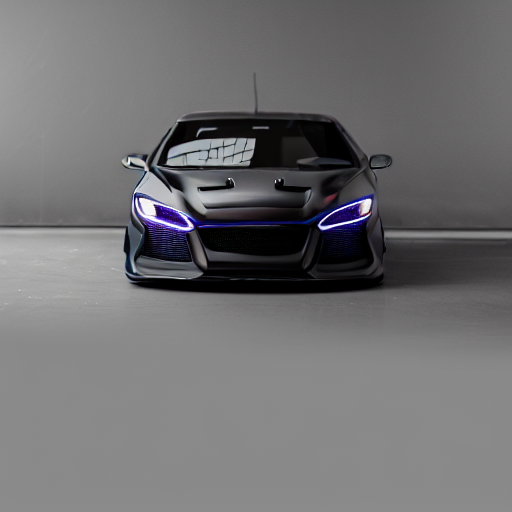
  <figcaption> Sample ControlNet enhanced Image from Stable Diffusion with LoRA</figcaption>
</figure>

# Quick Links
  
[Click Here](#generated-images) to view the generated images from finetuned Stable Diffusion.  
[Click Here](#sample-code-run-results) to view the results of the filter to detect the presence of an product.  
[Click Here](#results) to view the enhanced images of the product through inpainting and ControlNet.

# Problem Statement

In this task, I want to accomplish three key objectives
1. **Generative AI for Visuals**: Design an AI model to generate realistic product photoshoot visuals.
2. **Product Recognition Filter**: Develop an AI-based filter to identify and isolate specific products in a given image. If the object is present, enhance its visual appearance while preserving other parts of the image.
3. **Exclusion of Non-Relevant Images**: If none of the specified products are present, skip the image without applying any additional processing techniques.

# Overview of the Approach

The approach I have taken to solve this is based on three steps:

-  **Step 1** -  To generate accurate product photoshoots, I fine-tune the Stable Diffusion 1.5 model from RunwayML[(runwayml/stable-diffusion-v1-5)](https://huggingface.co/runwayml/stable-diffusion-v1-5) using LoRA on selected images of product photoshoot visuals.  

- **Step 2** - Once the visuals are generated, I use [Segment Anything](https://github.com/facebookresearch/segment-anything) from Facebook and [CLIP](https://github.com/openai/CLIP) from OpenAI to classify the segmentation masks using text prompts. If the specified product provided with the text prompt is found, the mask of the identified object is used for further processing and optimizing the selected product.

- **Step 3** -  To enhance the visual appearance of the project or even modify the attributes of the product, I use Image2Image Inpainting along with [ControlNet](https://github.com/lllyasviel/ControlNet) to more finely control the product while preserving the scene. This is facilitated by the product mask generated from the previous step.

Each of these steps is explained in more detail in the following sections.

# Explanation of the Process

## Step 1

Even though Stable Diffusion is quite powerful for generating realistic images, it can be further customized to emulate a particular art style. I view product photography as a form of art style that can be learned by the model.

### Training Methodology

Due to constraints in GPU capacity and time, fine-tuning all the parameters and weights of the Stable Diffusion model can be quite tedious. Therefore, after an initial literature search, I employed the[ Low-Rank Adaptation of Large Language Models (LoRA)](https://arxiv.org/abs/2106.09685) technique proposed by Edward J. et al.

Using this technique, it is possible to fine-tune LLMs for downstream tasks by inserting a small number of additional weights into the model and training them. This makes the fine-tuning of Stable Diffusion much faster and more feasible to experiment with and run on consumer-grade GPUs.

### Training Data

For fine-tuning, I sourced images from [Unsplash](https://unsplash.com/). Unsplash offers free high-quality images. The names of the images, along with the photographers, are cited in this [file](lora_training_images/image_list.txt).

<figure align="middle">
  
   
  
  <figcaption> Sample LoRA Finetuning Images</figcaption>
</figure>

### Generating Text Prompts

Once the images are selected, text prompts also need to be generated for fine-tuning Stable Diffusion. For generating the prompts, I used (BLIP: Bootstrapping Language-Image Pre-training)(https://arxiv.org/abs/2201.12086) from Salesforce, which has the capabilities of image captioning.

I utilized the framework provided by[kohya-colab](https://github.com/hollowstrawberry/kohya-colab) to generate these text prompts. The [Rahul Dataset Maker](notebooks/Rahul_Dataset_Maker.ipynb) notebook is run on the Google Colab service for the sake of quick experiments and faster hardware. Once the prompts are generated, they are stored as a text file with the same name as the image file to be later used for training. The set of training images and text prompts is available in the [lora_training_images](lora_training_images).

### Activation Tag

In addition to the tag generated from BLIP, another activation tag, `ppzocketv2`, is added to all the training images. During inference, when the same activation tag is used in the text prompt, it helps the Stable Diffusion model generate images more closely aligned with the training images.

### Finetuning the Stable Diffusion Model

Once again I use the [Rahul Lora Trainer.ipynb](notebooks/Rahul_Lora_Trainer.ipynb) adapted from [kohya-colab](https://github.com/hollowstrawberry/kohya-colab) and run it on Google Colab.

#### Training Parameters

- Total Number of Images: 65  
- Number of Repeats: 6  
- Batch Size: 2  
- Number of Epochs: 10   
- Steps per Epoch - 65*6/2 - 195 Steps
- Total Training Steps - 1950

The trained LoRA checkpoint is available [here](lora_checkpoint/ppzocketv2-10.safetensors).

### Generating Product Visuals from LoRA Checkpoint

Once we have the LoRA checkpoint, the next step is to perform inference on the trained model to generate product visuals. For this purpose, I use the
[Stable Diffusion Web UI](https://github.com/AUTOMATIC1111/stable-diffusion-webui), which provides a GUI-based inference platform for running Stable Diffusion models.

For prompts, I use the following template 

    ppzocketv2, "class", stylish, studio photography, product photography, ultra realistic, <lora:ppzocketv2-10:1>

`ppzocketv2`serves as the LoRA activation tag. `"class"` denotes the product class for which we need to generate visuals.  `<lora:ppzocketv2-10:1>`  instructs the Web UI to use the fine-tuning checkpoint along with the base model.

<figure align="middle">
  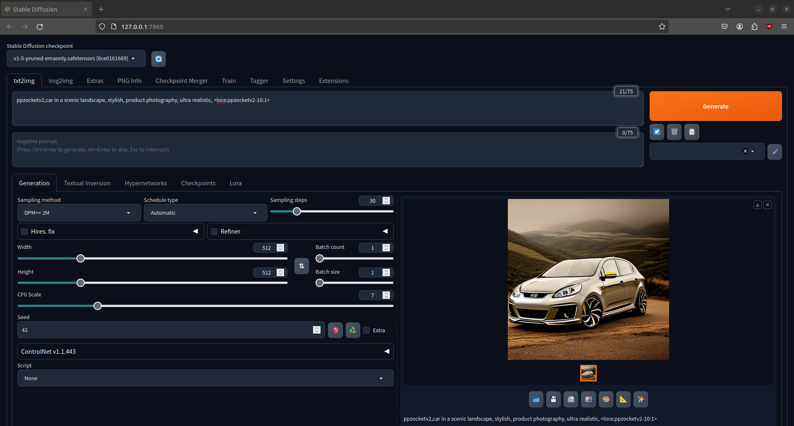
  <figcaption> Sample Screenshot of the WebUI</figcaption>
</figure>

### Generated Images
The image generated for different product visuals along with the prompt is located at [task1_outputs](task1_outputs). The thumbnails of the generated image is here:

  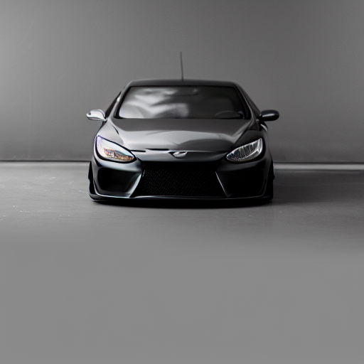
   
  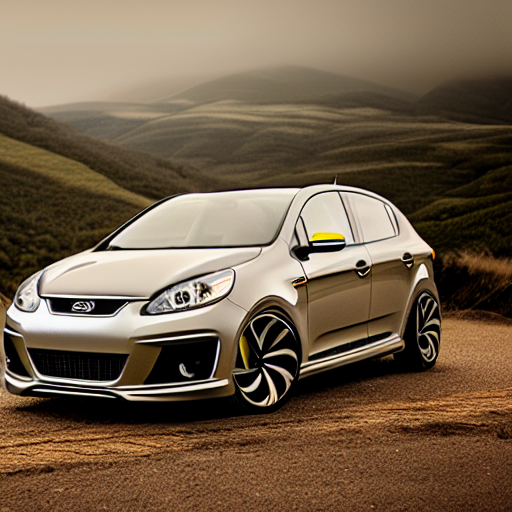

  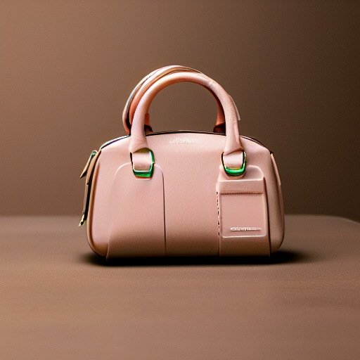
  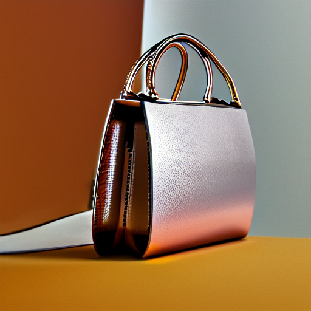 
  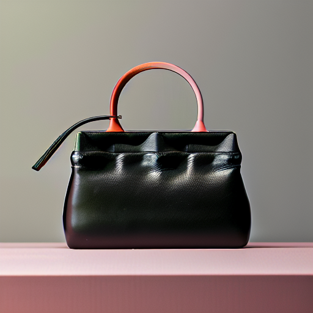
  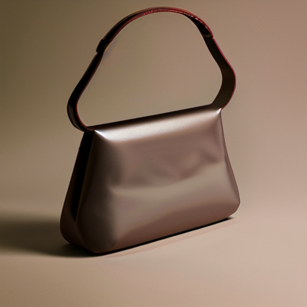

  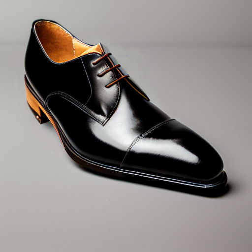
  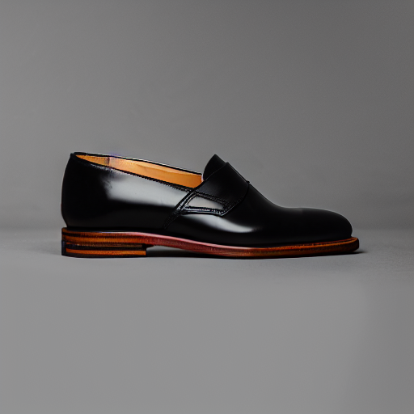

  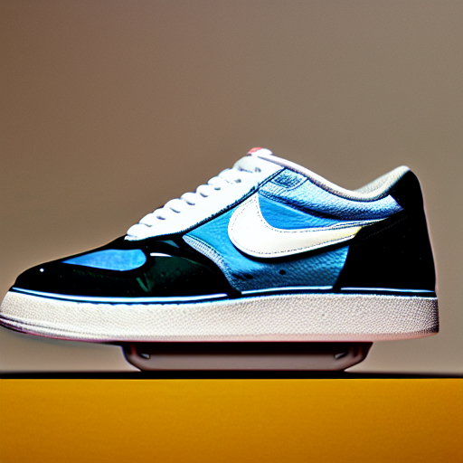
  
  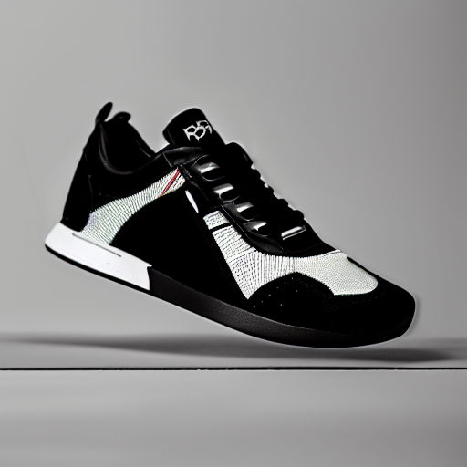

  
  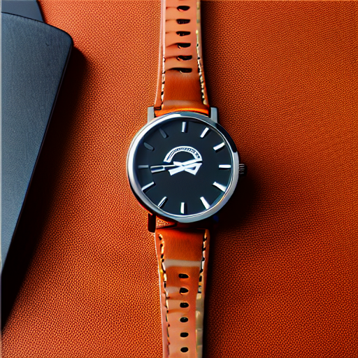
  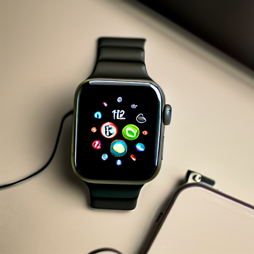

## Step 2

n this step, the task at hand is to determine if any of the products are present in the image. Additionally, to improve the product appearance, the mask indicating where the product is located also needs to be stored. Once we have the binary mask of the product, we can use it as a guide for inpainting in the next step.

The Segment Anything model is highly accurate at identifying foreground objects; however, it does not classify between different foreground objects. The position and class to which the foreground object belongs are also required. For classifying the proposed bounding boxes, I used CLIP, which demonstrates strong zero-shot capabilities. Therefore, for each bounding box, I check if any of them match with prompts generated from the class names and classify them accordingly.

I adapted the script from [segment-anything-with-clip](https://github.com/Curt-Park/segment-anything-with-clip) for the task of multi-class classification. The code is available at [image_filter.py](image_filter.py) and [image_filter_utils.py](image_filter_utils.py)

### Sample Code Run

    python image_filter.py

The input images used for this test are located at [filter_image_inputs](filter_image_inputs) and the outputs generated from the script are saved at [filter_image_outputs](filter_image_outputs). **All the input images were generated from the finetuned model in Step 1.** 

The product class can be described in the configration file at [config.yaml](conf/config.yaml). or the purposes of the experiment, the following product classes are used `["hand bag", "shoe","car","watch or watch dial"]`.

### Sample Code Run Results

<figure align="middle">
  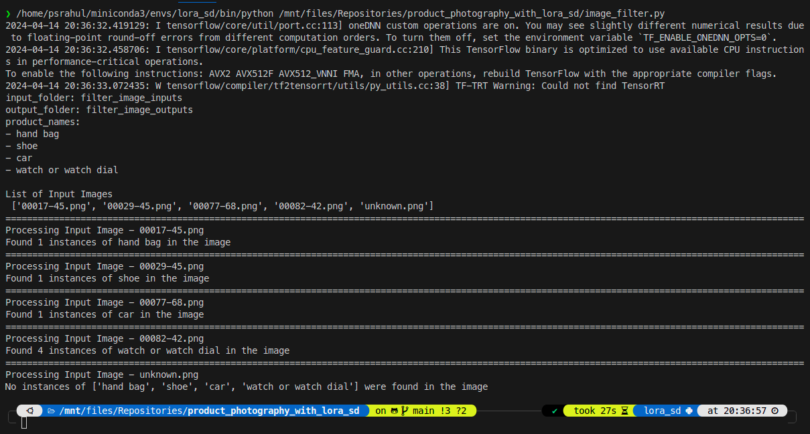
  <figcaption> Output screenshot from the console</figcaption>
</figure>

As seen in the screenshot, the program outputs whether any of the product classes are present in the image and the number of such regions found. For the final image, which is that of the moon, we can see that none of the product classes are present.

In the visualization below, each row represents a separate input image. The first image of each row represents the input image, and the following images show the masks generated for the identified objects. For the last image, since no products from the given list were identified, no masks are generated.

  
   

  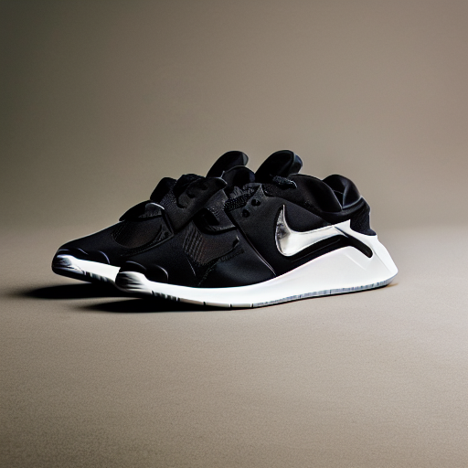
   

  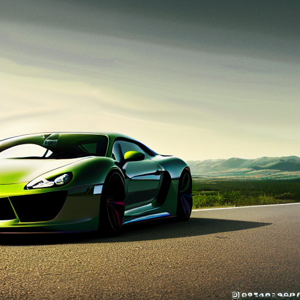
  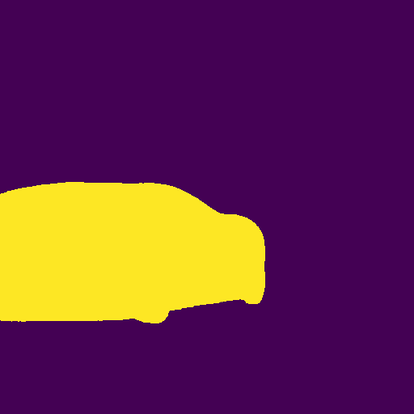 

  
   
  
  
  
  

  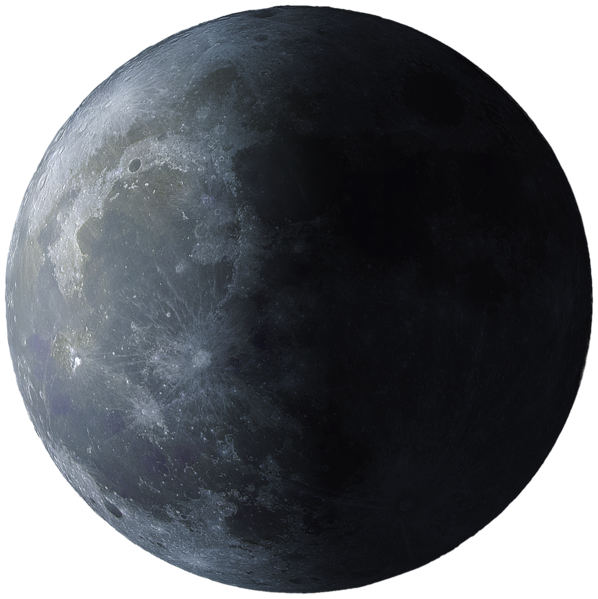

## Step 3

For the final step, I once again use the [Stable Diffusion Web UI](https://github.com/AUTOMATIC1111/stable-diffusion-webui) fto enhance the product visuals. Additionally, I use ControlNet to fine-tune the product details. The images and prompts are available in the folder [controlnet_images](controlnet_images).

The idea behind using ControlNet is to preserve the position and background details of the image and only vary the appearance in the inpainted region. By using a ControlNet model based on depth, the depth map in the source and generated images will be relatively similar. There are also many other ControlNet models that can be experimented with.

### Results

I use the image generated from Task 1 as the source for inpainting through the Image-to-Image generation pipeline. Additionally, the region to inpaint is specified using the product mask generated in the last step. For this experiment with ControlNet, I use the  `control_v11f1p_sd15_depth` model from [lllyasviel/control_v11f1p_sd15_depth](https://huggingface.co/lllyasviel/control_v11f1p_sd15_depth).

  
  
  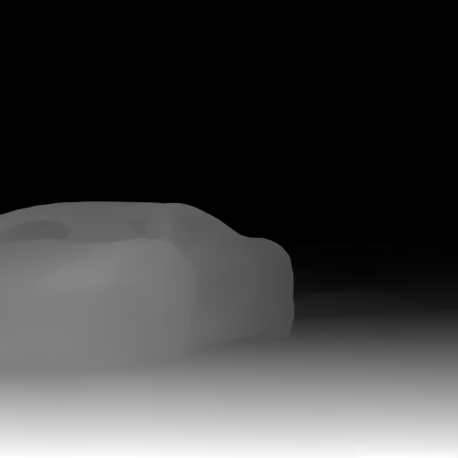 
   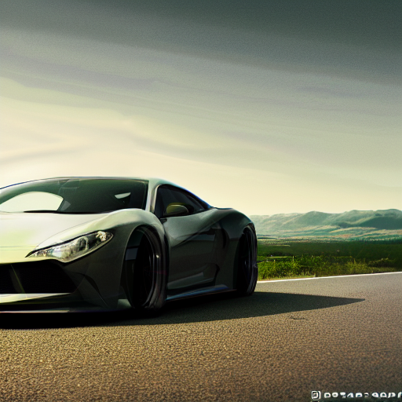
  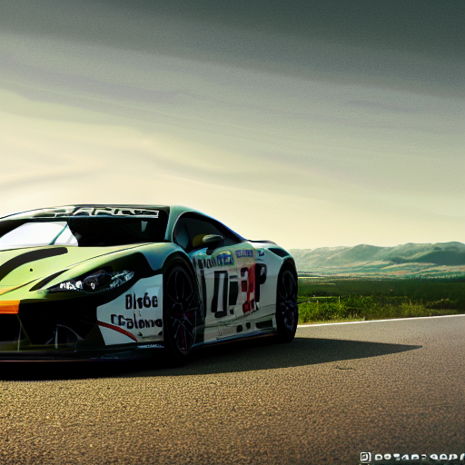

  

  
  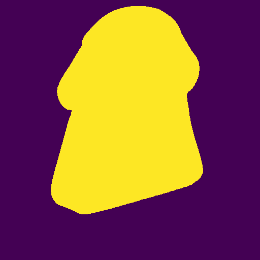 
  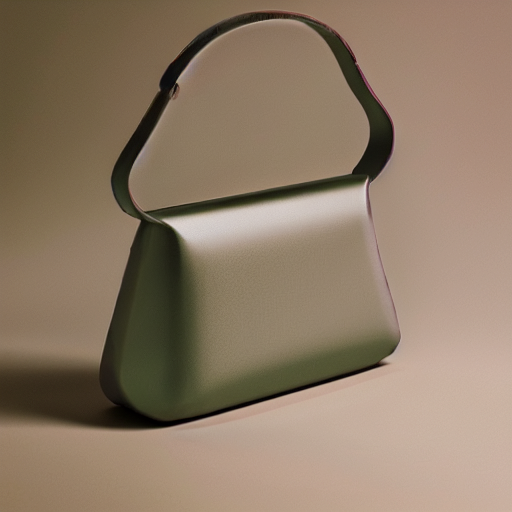
  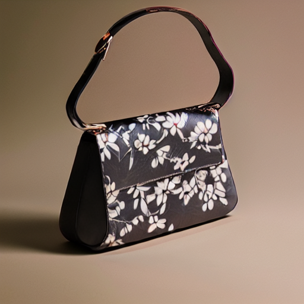
  

  

  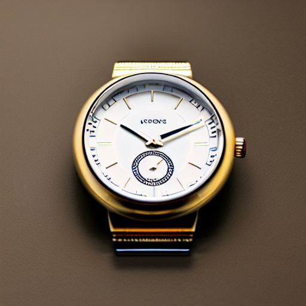
   
  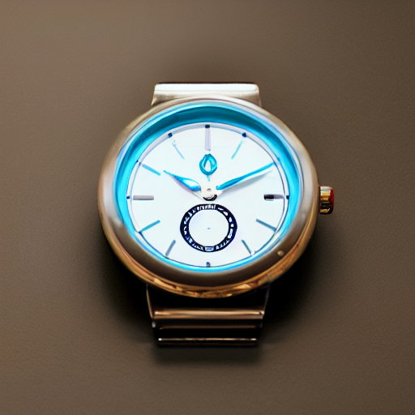
  

