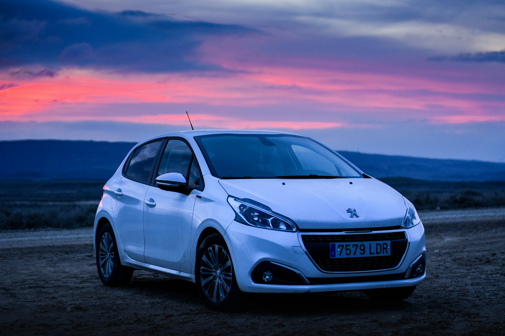

# AI-Enhanced Product Photoshoot Visuals and Filter

An experiment to generate highly accurate product photography using Low Rank Adapation (LORA) on Stable Diffusion

# Problem Statement

In this task, I want to accomplish the three key objectives
1. **Generative AI for Visuals**: Design an AI Model to generate product photoshoot visuals
2. **Product Recognition Filter**: AI based filter to identify and isolate specific products in a given image. If the object is present, enhance the visual appearence while preserving other parts of the image.
3. **Exclusion of Non-Relevant Images**: If none of the products specified are present, skip the image without any additional processing techniques.

# Overview of the Approach

The approach I have taken to solve this is based on three steps

-  **Step 1** - To generate accurate product photoshoots, I fine tune the **Stable Diffusion 1.5** model from RunwayML [(runwayml/stable-diffusion-v1-5)](https://huggingface.co/runwayml/stable-diffusion-v1-5) on selected images of product photoshoot visuals.  

- **Step 2** - Once the visuals are generated I use [Language Segment-Anything](https://github.com/luca-medeiros/lang-segment-anything) that builds on [Segment Anything](https://github.com/facebookresearch/segment-anything)from Facebook and [GroundingDINO](https://github.com/IDEA-Research/GroundingDINO) from IDEA Research to guide image segmentation using text prompts.  

- **Step 3** -  If the given product that is provided with the text prompt is found, the image is used for further processing and optimising the chosen product. To accomplish this I use [ControlNet](https://github.com/lllyasviel/ControlNet) to more finely control the product while preserving the scene.

Each of these steps are explained in more detail in the next sections.

# Explanation of the Process

## Step 1

Even though stable diffusion is quite powerful to generate realistic  images, it can be even more customised to generate an particular art style. I see product photography as also a form of art style that can be learnt by the model. 

### Training Methodology

Due to constraints with GPU capacity and time, fine-tuning the all the parameters and weights of the Stable Diffusion model is quite tedious. Therefore, after initial literature search, I used the [ Low-Rank Adaptation of Large Language Models (LoRA)](https://arxiv.org/abs/2106.09685) technique proposed by Edward J et. al.

Using this technique, it is possible to finetune LLMs for downstream task by inserting small number of additional weights into the model and training them. This makes the fine tuning stable diffusion much faster to experiment and run on consumer grade GPUs.

### Training Data

For finetuning, I sourced images from [Unsplash](https://unsplash.com/). Unsplash provides free high quality images. The names of images along with the photographers are cited in this [file](lora_training_images/image_list.txt).

  
   
  

### Generating Text Prompts

Once the images are selected, the text prompts also need to be generated for finetuning stable. For generating the prompts, I used (BLIP: Bootstrapping Language-Image Pre-training)(https://arxiv.org/abs/2201.12086) from Salesforce that has the capabilities of image Captioning.

I use the framework provided by [kohya-colab](https://github.com/hollowstrawberry/kohya-colab) to generate these text prompts. The [Rahul Dataset Maker](notebooks/Rahul_Dataset_Maker.ipynb) notebook is run on Google Colab service for the sake of quick experiments and faster hardware. Once the prompts are generated, these are stored as a text file with the same name as the image file to be later used for training. The set of training images and text prompts are available at [lora_training_images](lora_training_images).

### Activation Tag

In addition to the tag generated from BLIP, another activation tag called `ppzocketv2` is added to all the training images. During inference, when the same activation tag is used in the text prompt, this will help the stable diffusion model to generate images more closely to the training images.

### Finetuning the Stable Diffusion Model

Once again I use the [Rahul Lora Trainer.ipynb](notebooks/Rahul_Lora_Trainer.ipynb) adapted from [kohya-colab](https://github.com/hollowstrawberry/kohya-colab) and is again run on Google Colab. 

#### Training Parameters

- Total Number of Images: 65  
- Number of Repeats: 6  
- Batch Size: 2  
- Number of Epochs: 10   
- Steps per Epoch - 65*6/2 - 195 Steps
- Total Training Steps - 1950

The trained LoRA checkpoint is available [here](lora_checkpoint/ppzocketv2-10.safetensors).
### Generating Product Visuals from LoRA Checkpoint

## Step 2

## Step 3

# Solutions

Task 1 Prompt - ppzocketv2, "class", stylish, studio photography, product photography, ultra realistic, <lora:ppzocketv2-10:1>

